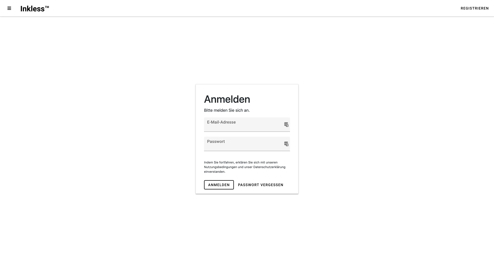
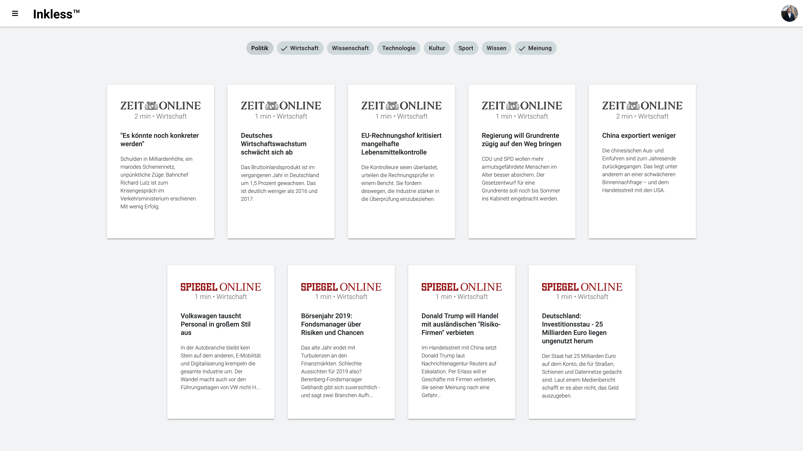
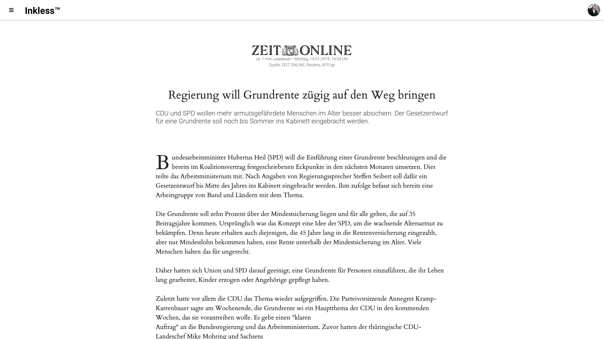

# inkless frontend

a showcase react app from 2018

## Project information

This webapp displays news articles from a graphql-based backend.

* Most components have snapshot tests in place.
* Project was setup using `create-react-app`.
* Folder structure follows atomic design.
* There are some graphql mutations in place, for example the reading time of an article will be sent to the backend

## Technically interesting parts
- graphql with `apollo.js`
- `redux` (partially persisted)
- authentication via JWT
- material design sass imports

## What could have been improved
If I had spent more time on this project, I would have fixed some things

* there are three providers: apollo, redux, redux-persist. Apollo could have been connected more cleanly to redux.
* the graphql queries and mutations are not complicated. Maybe a more lightweight implementation like `graphql-js` would have been enough
* currently the rules of `react-app` are used for linting. With more time on the project, I would have invested in a stricter ruleset for linting and folder structure.
* there are currently no storybook stories for the components
* the annoying sass file compilings resulting in 3 files
* due to cleaning up some copyrighted logos etc. some files (e.g. `utils.js`) don't make a lot of sense anymore

## Screenshots

**Disclaimer**: I don't own any of the articles contents, they belong to the respective publishers. I cleaned up some parts containing copyrighted logos, article contents, etc.
If I missed something feel free to give me a heads up.
